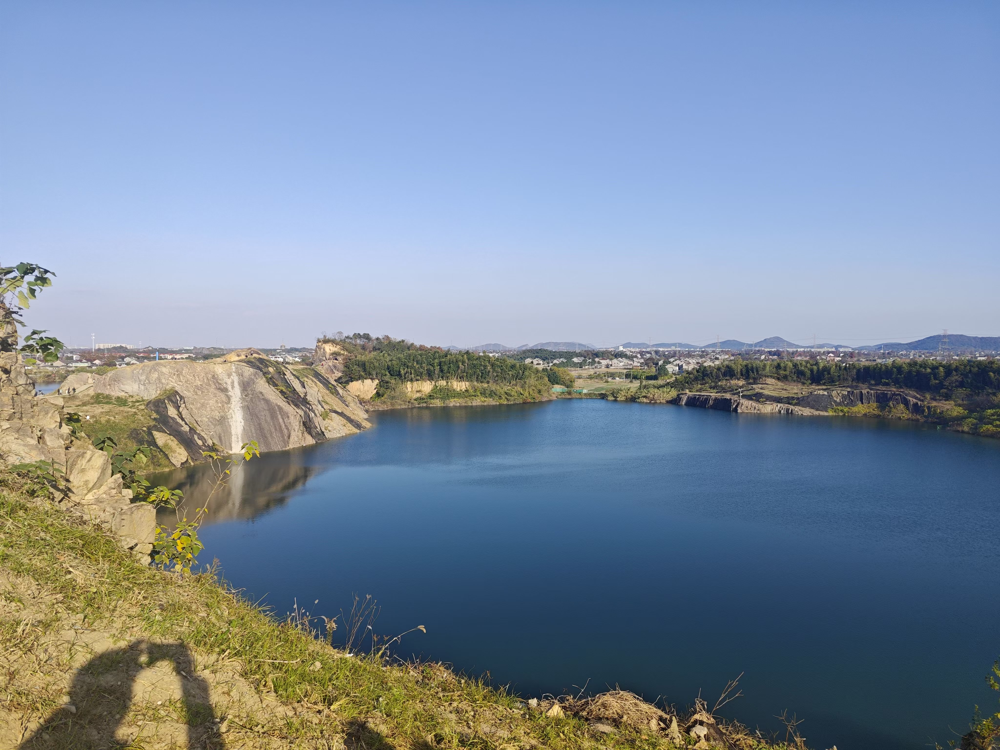

# 2024

在这里记录我2024年的旅程...
这一年我看到了很多美丽的风景，
有很多很有意思的心路历程，
回看这些照片，
一切仿佛都发生在昨天。

- 1月1日
连云港
 
 
- 1月27日
苏州太阳山
 
 
- 2月9日
上海图书馆东馆
 
- 2月16日
上海南翔参观浣熊
 
- 3月2日
杭州九溪十八涧 
 
 
- 3月9日
常熟虞山
 
 
- 3月23日
绍兴穿岩十九峰

 
- 4月4日
广汉三星堆
 
 
- 4月20日
绍兴安山古道
 
 
 
- 5月1日
上海嘉北郊野公园
 
 
- 5月11日
中国品牌日
 
 
 

- 5月18日
宁波风车公路
 
 
 
- 5月25日
湖州章里古道
 
 
- 5月31日
苏州西园寺
 

- 6月15日
大洋山岛
 
 
 
- 6月29日
湖州莫干山
 
 
- 7月6日
上海世界人工智能大会
 

- 7月20日
安吉三步石溯溪

 
 
 
- 8月2日
夜骑上海
 
 
- 8月16日
上海书展
 
 
 
- 8月17日
宁波河姆渡遗址&浙江东小九寨
 

 
 
- 8月24日
"猴书"线下分享活动

 
- 9月4日
"猴书"线下分享活动

- 9月6日
上海外滩大会

 

- 9月15日
厦门集美区

 
- 9月16、17日
厦门岛
 

 

- 10月19日
浦江仙华山
 

 

- 11月17日
骑行到千灯镇

- 11月24日
更楼古道
 

- 11月30日
上海海昌海洋公园
 
 
 
- 12月8日
嘉兴海宁

 
- 12月15日
湖州龙王山
 
 

